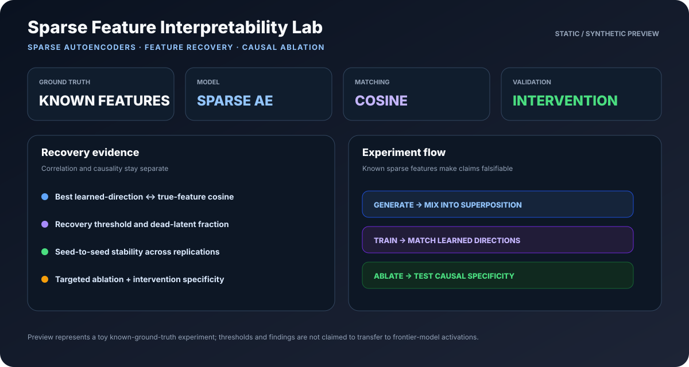
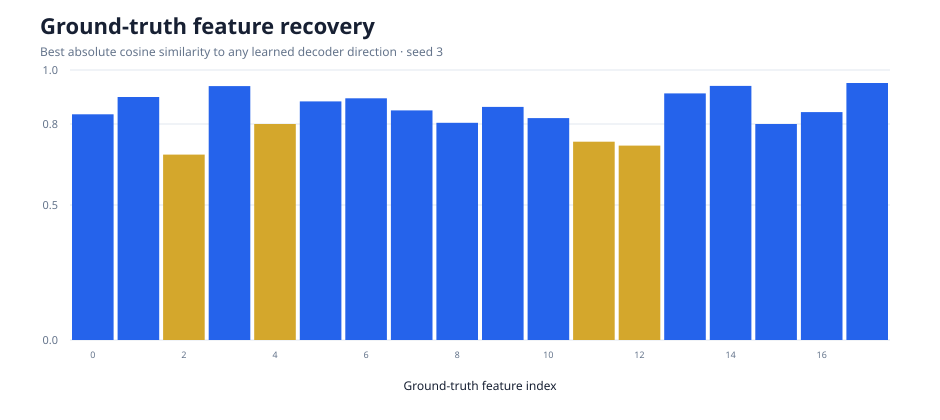
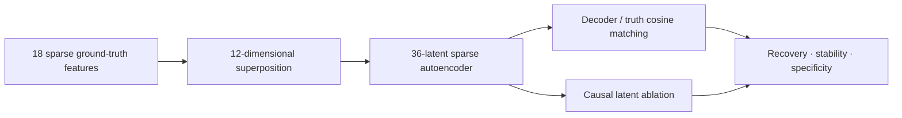

<div align="center">

# Sparse Feature Interpretability Lab

### Train sparse autoencoders, recover known features, and test explanations with causal interventions

[](https://www.python.org/)
[](https://numpy.org/)
[](https://github.com/VinayK88/sparse-feature-interpretability-lab/actions/workflows/tests.yml)
[](LICENSE)

**Generate · train · match · intervene · replicate**

</div>

---



A small, reproducible mechanistic-interpretability experiment built to answer a falsifiable question: when known sparse features are mixed into a lower-dimensional representation, can an overcomplete sparse autoencoder recover their directions—and do interventions on those learned latents causally change the intended feature?

The entire model and optimizer are implemented in NumPy. No model download, GPU, or hidden API result is required.



## 60-second reviewer path

Short on time? Review the project in this order:

1. [Understand the controlled experiment](#experimental-setup).
2. [Inspect the interpretability metrics](#what-is-measured).
3. [Review the checked-in baseline](#checked-in-baseline).
4. [Reproduce the experiment](#quick-start).
5. [Read the limitations and next tests](#limitations-and-next-experiments).

## Experimental setup



The synthetic generator deliberately includes:

- More latent features than observed dimensions.
- Sparse non-negative activations.
- Two correlated feature pairs.
- Small observation noise.
- Exact ground-truth directions for quantitative validation.

## What is measured

| Metric | Purpose |
| --- | --- |
| Best cosine similarity | Does any learned decoder direction align with each true feature? |
| Recovery at 0.80 / 0.90 | What fraction of features clear an explicit match threshold? |
| Dead-latent fraction | Is capacity unused? |
| Seed-to-seed standard deviation | Is recovery stable across initializations? |
| Targeted projection drop | Does ablating the matched latent reduce the intended feature direction? |
| Intervention specificity | Is the effect larger on active examples than inactive examples? |

Feature similarity is correlational. The ablation step adds causal evidence; neither alone is treated as a complete explanation.

## Quick start

```bash
python -m venv .venv
source .venv/bin/activate
python -m pip install -e .

sparse-feature-lab
python -m unittest discover -s tests -v
```

The default run trains three seeds and writes:

- [`reports/baseline.json`](reports/baseline.json): configuration, loss curves, recovery metrics, and interventions.
- [`reports/feature_recovery.svg`](reports/feature_recovery.svg): a dependency-free visual summary.

### Checked-in baseline

| Result | Value |
| --- | ---: |
| Mean best cosine similarity | 0.849 |
| Features recovered at 0.80 | 75.9% |
| Seed-to-seed standard deviation | 0.010 |
| Median causal-intervention specificity | 23.24× |

The recovery rate is deliberately below 100%: correlated features and a representation with fewer observed dimensions than true features keep the benchmark from becoming a trivial identity-recovery exercise.

## Implementation details

- Rectified linear encoder with an overcomplete latent dictionary.
- Unit-normalized decoder directions.
- Reconstruction loss plus mean L1 activation penalty.
- Full-batch Adam implemented directly in NumPy.
- Absolute cosine matching between learned and true directions.
- Latent ablation followed by projection onto the ground-truth feature.

## Repository map

```text
src/sparse_feature_lab/
├── data.py        synthetic superposition generator
├── model.py       NumPy sparse autoencoder and optimizer
├── analysis.py    feature matching and causal ablation
├── experiment.py  multi-seed replication
├── visualize.py   standalone SVG report
└── cli.py         reproducible command
tests/             optimization and causal invariants
reports/           checked-in results and figure
```

## Limitations and next experiments

This toy setting has known, linear ground truth and is dramatically simpler than a frontier language model. A successful run demonstrates research hygiene and interpretability mechanics—not a claim that the same thresholds transfer to real activations.

Next steps:

- Sweep sparsity, dictionary width, noise, and correlated features.
- Add feature splitting/merging diagnostics and top-activation examples.
- Compare sparse autoencoders with PCA and non-negative matrix factorization.
- Train on cached activations from a small open-weight transformer.
- Pre-register match thresholds and evaluate on held-out feature dictionaries.

Licensed under the [MIT License](LICENSE).

<!-- portfolio-order: current-ai-systems -->
